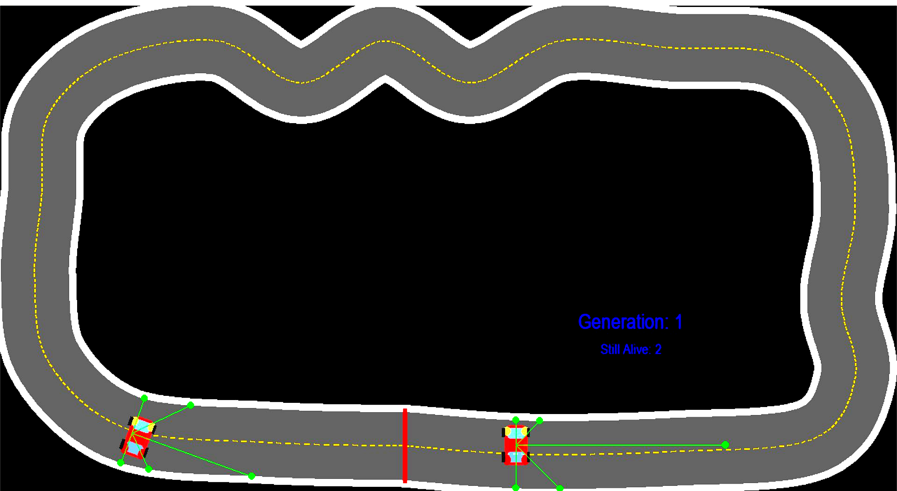

# Self Driving Car using NEAT

This project is a self driving car simulation that uses a machine learning algorithm called NEAT (NeuroEvolution of Augmenting Topologies) to teach cars how to drive around a track on their own. The cars start off not knowing anything and slowly get better over time through evolution.

## Demo

Generation 1 showing 2 cars still alive on the track with their green radar sensors scanning the walls around them.



## What is NEAT

NEAT is an algorithm that evolves neural networks over generations. It works kind of like natural selection. Cars that do well survive and pass their traits to the next generation. Cars that crash early get removed. After many generations the cars get really good at staying on the track.

## How the Car Works

Each car has 5 radar sensors that shoot out in different directions and measure how far the track wall is. These 5 distances are fed into the neural network as inputs. The network then decides whether the car should turn left or turn right. The car always moves forward at a constant speed so the only decision is steering.

The car gets a reward based on how far it travels before crashing. Cars that go farther get a higher fitness score and are more likely to survive into the next generation.

## Files

```
car_simulation.py   the main simulation code
config.txt          NEAT settings like population size and mutation rates
car.png             the car sprite image
map.png             the race track image
```

## How to Run

First install the required libraries.

```
pip install pygame neat-python
```

Then run the simulation.

```
python car_simulation.py
```

The window will open and you will see the cars start driving. Each generation the cars should get a little better. You can press Escape to quit at any time.

## Settings

The config.txt file controls how the evolution works. The population is set to 30 cars per generation. If all cars crash before the time limit the generation ends early. The simulation runs for up to 1000 generations but you can close it whenever the cars are driving well enough.

## What to Expect

Through many iterations and repeated experimentation, I optimized the implementation so the car can successfully navigate the track within the first few attempts. Future versions of the project will introduce higher difficulty levels and more complex track environments.
